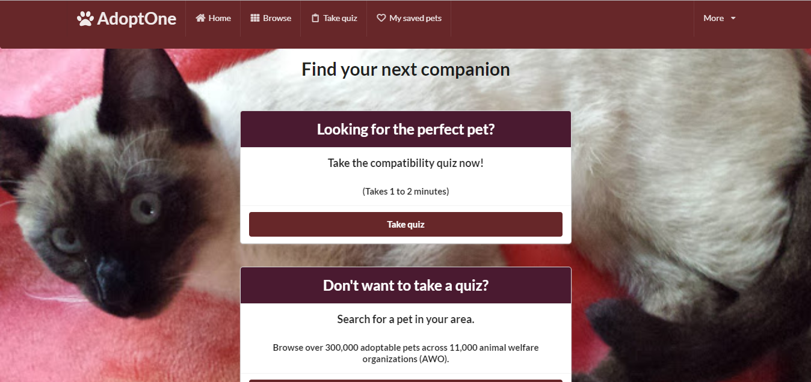
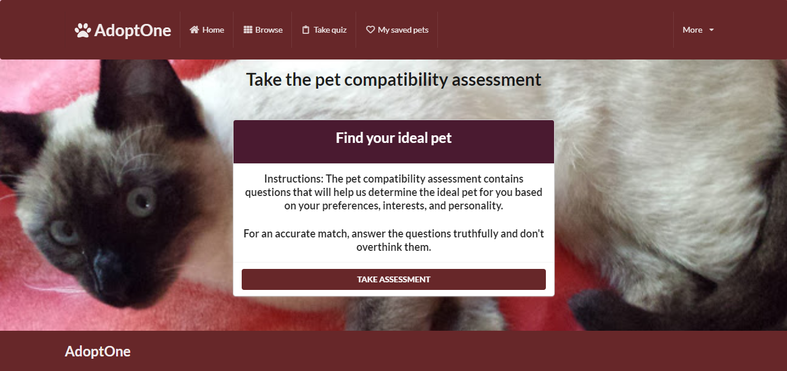
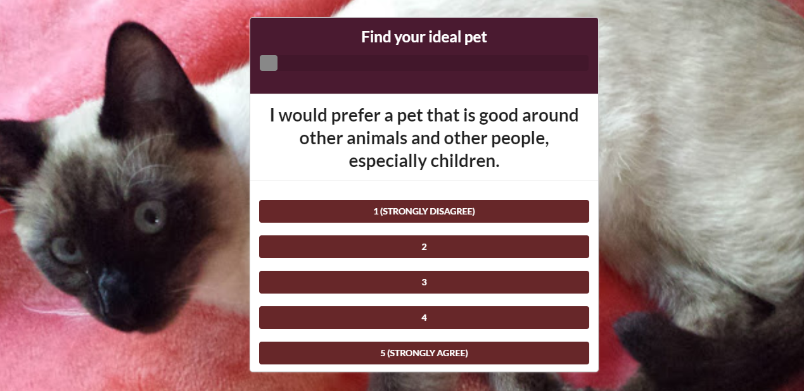
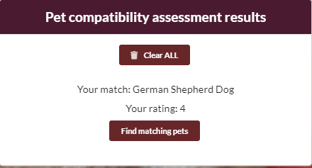
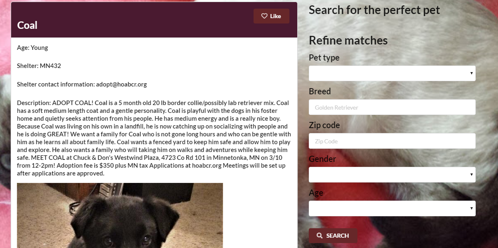
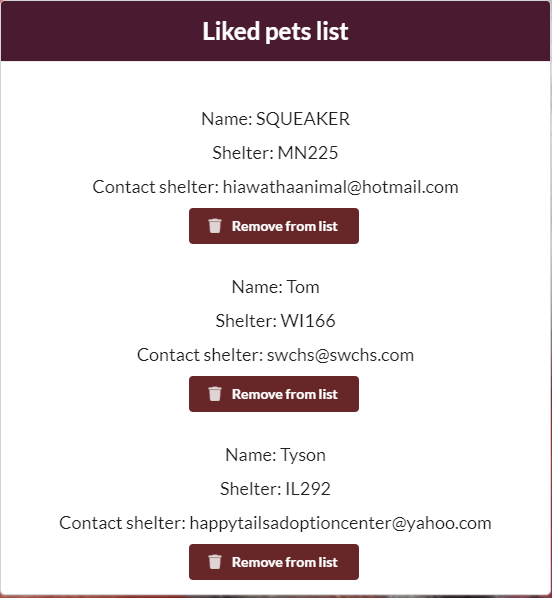
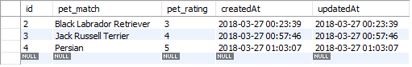
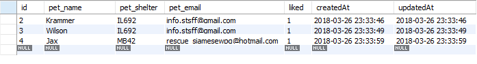

# AdoptMeNow

AdoptMeNow is a full stack, MVC (Model-View-Controller) application that connects people with animal welfare organizations (AWO) in their area and helps streamline and simplify the pet adoption process. With this application, you can do the following:

<ul>
	<li>Take a compatibility assessment and receive suggested pets that reflect your personality, preferences, and interests.</li>
	<li>Save your assessment results.</li>
	<li>Search for adoptable pets at animal shelters in your area based on your assessment results. You can search by breed, type, gender, and age.</li>
	<li>Add the pets that you might consider adopting to a favorites list, which allows you to quickly look up those pets and their contact information later</li>

## Table of contents
  * [Live](#live)
  * [Screenshots](#screenshots)
  * [About this project](#about-this-project)
  * [Contributors](#contributors)
  * [Getting started](#getting-started)
  * [Structure of the project](#structure-of-project)
  * [Technologies used to create app](#technologies-used)
  	* [Backend technologies](#Backend)
  	* [Frontend technologies](#Frontend)
    * [About the Petfinder API](#petfinder)
  * [Design improvements](#design-improvements)
  * [Issues](#Issues)

## Live
https://pet-match-app.herokuapp.com/

##  Screenshots

### Home page

### Pet compatibility assessment

 
 

 
 

### Pet search page

### My saved pets page

##  About this project

  * [How the app works](#how-app-works)
  * [How the app is built](#how-the-app-is-built)
  * [MVC design pattern](#about-mvc)
 
###  How the app works
This project is a full stack application that helps simplify the pet adoption process. The application is meant to help connect you with animal shelters and pet rescue organizations in your area. 

When you first start using the app, you will be taken to the home screen. When you get to the home screen of the app, you have two options. You can log in to the app using Facebook and take a compatibility assessment, which takes you through a series of questions and matches you with a pet based on your personality, preferences, and interests. After you take the quiz, you will get your results back, and you can use those results and the pet search feature to search for matching pets in your area. At the end of the quiz, you also have the option to save your results to view later, which saves them to the <b>My saved pets</b> page as well as to the MySQL database. 

If you don't want to take an assessment, you can skip the quiz and go straight to the pet search page to search. When you are searching for pets, you can refine the search by searching on gender, age, breed, and pet type. When you perform a search, the search results return the name, age, shelter ID, shelter contact information, and a short description about each pet. Also, you will notice that each pet has a <b>Like</b> button associated with it. If you find a pet that you might want to adopt, click <b>Like</b> next to that pet. Liking a pet adds that pet's name and the shelter contact information to the database and to the <b>My saved pets</b> page. The <b>My saved pets</b> page contains both the assessment results (if you chose to save the results at the end of the assessment) and a list of liked pets. If you decide that you are no longer interested in a pet that you liked, you can remove the pet by clicking <b>Remove from list</b>, which deletes the pet from the user interface as well as from the MySQL database.

###  How the app is built
This project uses MySQL, Node.js, Express, Handlebars, Sequelize, and Semantic UI. Node and MySQL are used to query and route data in the application. Express is the backend web framework used for this application, and Handlebars is a templating language that is used to generate the HTML. Semantic UI is a CSS framework that is used to design and build the front end part of the site. Sequelize is an ORM (Object Relational Mapper), which helps in managing database queries in an effective manner.

###  MVC design pattern
This project also follows the MVC (Model-View-Controller) design pattern. The MVC design pattern assigns objects in the application one of three roles (model, view, or controller) and defines the way the different parts of the application communicate with one another.

  * <b>View object:</b>
  A view object is an object in the application that is visible (in the user interface) to the end user of the application. The view displays data from the application's model and learns about any changes to the model data via the controller. For example, in this application, the user clicks the <b>Like</b> button next to the name of the pet that they want to add to their favorite pets list. The view communicates the pet information associated with the <b>Like</b> button via the controller to the model.

  * <b>Controller object:</b>
  A controller object controls the flow of data between the view and the model (that is, the controller is an intermediary between the two). The controller interprets any user changes made in the view and communicates the changed data to the model. Also, if the model were to change, the controller is what communicates the updated data to the view so that the user can see the updated data in the user interface.

  * <b>Model object:</b>
  A model object manages the data. When data is created or changed by the user in the view (for example, a user takes the pet compatibility assessment and saves the results), that change is communicated via the controller to the model. Also, when data is created or changed in the model, the model communicates that change via the controller to the view, and the view displays the updated data to the user.

For more information about the MVC design pattern, check out the following resources:
  * https://en.wikipedia.org/wiki/Model%E2%80%93view%E2%80%93controller
  * https://docs.microsoft.com/en-us/aspnet/core/mvc/overview

##  Contributors
* Back End Developer: Amin Kedir
* Back End Developer: Robin Bertuccelli 
* Front End Developer: Joy Hollela
* Front End Developer/Project Manager: Phil Stubbs

##  Getting started
The following section will take you through the steps of setting up this application and getting it running locally on your computer.

If you don't want to set up this project locally and just want to see the deployed application, go to  https://pet-match-app.herokuapp.com/

To set up this application locally on your computer, perform the following steps:
1. [Clone the repository](#clone-repository)
2. [Install Node.js](#install-node)
3. [Install the dependencies](#dependencies)
4. [Install MySQL Workbench](#install-mysql)
5. [Set up a development database](#database-setup)
7. [Verify database connection information](#db-connect)
8. [Start the server](#start-server)

###  1. Clone the repository
The first step is to clone the project repository to a local directory on your computer. To clone the repository, run the following commands:
<pre>
  git clone https://github.com/robinb242/PetMatch.git
  cd Pet Match
</pre>

####  Structure of the project

After you clone the repository, navigate to the project root directory (PetMatch). The project directory structure is set up as follows:

<ul>
  <li> 
    
<b>server.js</b>: This file does the following:

		<ul>
	    	<li>Defines and requires the dependencies, including express, body-parser, and express-handlebars.</li>
	    	 <li>Sets up the Express server.</li>
	    	 <li>Sets up the Express server to handle data parsing using body-parser.</li>
	    	 <li>Points the server to the API routes, which gives the server a map of how to respond when users visit or request data from various URLs.</li>
        	<li>Defines the port the server is listening on.</li>
	    	 <li>Starts the server.</li>
         	<li>Allows the app to serve static content from the public directory.</li>
    	</ul>
  <li>
    
<b>public</b>: Contains the static, front end content (images, Javascript, and CSS). 

    <ul>
      <li><b>assets/css/style.css</b>: External CSS stylesheet.</li>
      <li><b>assets/img</b>: Contains the background image used in the app.</li>
      <li><b>assets/src/modals</b>: Contains the front end Javascript that opens the modals in the application.</li
	  <li><b>assets/src/petDelete</b>: Contains the front end Javascript used to delete a liked pet from the <b>My saved pets</b> page as well as delete the compatibility assessment results.</li>
	  <li><b>assets/src/petSearch</b>: Contains the front end Javascript that allows a user to search for a pet. When a user fills outs the pet search form, a query is made to the Petfinder API based on the user input from the search form. The matching pets are returned from the API and displayed to the user in the application user interface.</li>
	  <li><b>assets/src/petMatch</b>: Contains the front end Javascript used to run through the list of assessment questions and come up with a potential pet match for a user.</li
    </ul>
  </li>
  <li>
    
<b>models</b>: Contains information used to manage the application data and interact with the database. The models describe the structure of the database tables, and the datatypes that each column of the table can contain. For this project, the database includes two models:

	<ul>
		<li>
<b>match.js</b>: This defines the sequelize model for saving users' assessment results to the MySQL database. The model defines a database table that has two columns (one for the assessent results and one for the match rating).

    </li>
      

		<li>
<b>pets.js</b>: This defines the sequelize model for saving any pets that the user likes to the MySQL database. The model defines a database table that includes columns for pet name, pet shelter location, shelter contact information, and whether or not the user likes the pet.

    </li>
    
  <li>
    
<b>db/schema.sql</b>: Contains code that you can run to create and set up a MySQL database locally on you computer.</li>
  </li>
  <li>
    
<b>config</b>: Contains the config.json file, whic includes the code to connect Node to MySQL.
  </li>
  <li>
    
<b>controllers</b>: Contains two files.

		<ul>
			<li><b>petMatchController.js</b>, which contains different routes for getting and posting user assessment results. These routes are used to pass information to and from the view and model objects.</li>
			<li><b>savedPetsController.js</b>, which contains different routes for posting liked pet information to the database, getting pet data from the database, and deleting liked pet information from the database.</li>
		</ul>
  <li>
    
<b>views</b>: Contains the Handlebars files, which are small, resuable blocks of code used to generate the HTML files.
 
  </li>
  <li><b>package.json</b>: Lists the project dependencies (third party npm packages) and their version numbers.</li>
  <li><b>.gitignore</b>: Anything listed inside this file will not be tracked by GitHub when code is committed.</li>
  <li><b>package-lock.json</b>: Dependency tree for the project. Lists all the dependencies and their versions.</li>
  <li><b>data/animal.js</b>: This file includes an array of objects, which is where the pet compatibility data is stored.</li>
</ul>

###  2. Install Node.js

If you don't already have Node.js installed on your computer, you can install the latest version here: https://nodejs.org/en/.

###  3. Install the dependencies

The following npm packages are dependencies to the project.

After you clone the repository to a local directory, change directory to the project root directory and run the following command to install the required npm packages:

<pre>npm install</pre>
<ul>
	<li><b>express</b> -  a Node.js web application framework (https://www.npmjs.com/package/express).</li>
	<li><b>body-parser</b> - used to parse incoming request bodies in a middleware. (https://www.npmjs.com/package/body-parser)</li>
	<li><b>dotenv</b> - used to retrieve the Petfinder API key from a .env file (https://www.npmjs.com/package/dotenv).</li>
  <li><b>mysql2</b> - used to create a connection to the MySQL database via the command line.(https://www.npmjs.com/package/mysql)</li>
  <li><b>express-handlebars</b> and <b>handlebars</b> - allows you to use handlebars to create templates to build the HTML.(https://www.npmjs.com/package/express-handlebars)</li>
  <li><b>sequelize</b> - sequelize is used as the project's ORM to manage and simplify queries to the MySQL database.</li>
</ul>

Version information for each of these packages is available in the <b>package.json</b> file in the project root directory.

###  4. Install MySQL Workbench

If you don't already have MySQL Workbench installed on your computer, you can install the latest version here: https://www.mysql.com/products/workbench/

For this project, MySQL Workbench is used to visually design, create, and manage the database used to store pet data.

###  5. Set up a development database
To set up a development database that you can use with this application, perform the following steps:
<ol>
<li>
Open the <b>db/schema.sql</b> file and paste the contents of this file into MySQL Workbench.
</li>
<li>
Execute the following statements:

  <pre>
  CREATE DATABASE petMatchDB;
  USE petMatchDB;
  </pre>
  
Running these statements creates a database called <b>petMatchDB</b> and sets it as the current database being used.

</li>
</ol>

### <a name="db-connect">7. Verify database connection information</a>

Open the <b>config/config.json</b> file and verify that the database connection information (host, username, password, and database) in the development section reflects the database you just created.

Modify the connection properties as needed to reflect your database instance.

For example:

<pre>
{
  "development": {
    "username": "root",
    "password": "",
    "database": "petMatchDB",
    "host": "127.0.0.1",
    "dialect": "mysql"
  },
</pre>

### <a name="start-server">8. Start the server</a>

After performing all of the setup steps in the <b>Getting started</b> section, navigate to the project root directory (PetMatch) and run the following command to start the server:

<pre>
nodemon server.js
</pre>

If  you don't have nodemon installed on your computer, you can also start the server by running the following command. However, every time you make a change to the server, you will need to restart the server to view the change in the user interface.

<pre>node server.js</pre>

To verify that the server has started and the application is working locally on your computer, open Chrome and go to <a href="http://localhost:3000">http://localhost:3000</a>.

##  Technologies used to build app
* [Backend technologies](#Backend)
* [Frontend technologies](#Frontend)

###  Backend technologies
* Node.js (https://nodejs.org/en/)
* MySQL (https://www.mysql.com/)
* Express (http://expressjs.com/)
* Sequelize ORM (http://docs.sequelizejs.com/)
* Javascript
* Facebook authentication (https://developers.facebook.com/docs/facebook-login/web)

###  Frontend technologies
* HTML
* CSS
* Semantic UI (https://semantic-ui.com/)
* Javascript
* jQuery (https://jquery.com/)
* Handlebars (http://handlebarsjs.com/)

###  About the Petfinder API
The Petfinder API gives developers access to Petfinder's database of over 300,000 adoptable pets and 11,000 animal welfare organizations (AWO). 

To learn more about this API and the various API methods available, see the API documentation.
* https://www.petfinder.com/developers/api-docs
* https://github.com/helenuria/Petfinder-API

Petfinder requires developers to use a key to access the API data. To use the Petfinder API, you'll also need a (free) Petfinder developer account.

After you have a key, you can use the API to search for adoptable pets in your area.

##  Design improvements
* Add feature that allows users to directly send an email to the shelter where the pet is located.
* Do more research. Go to an animal shelter and find out more about the pet adoption process. Take ideas and suggestions from research to improve and streamline the app.
* Integrate app more with Facebook authentication. For example, grab information from user's profile to find pet suggestions.

##  Issues

If you find an issue while using the app or have a request, <a href="https://github.com/robinb242/PetMatch/issues" target="_blank">log the issue or request here</a>. These issues will be addressed in a future code update.
